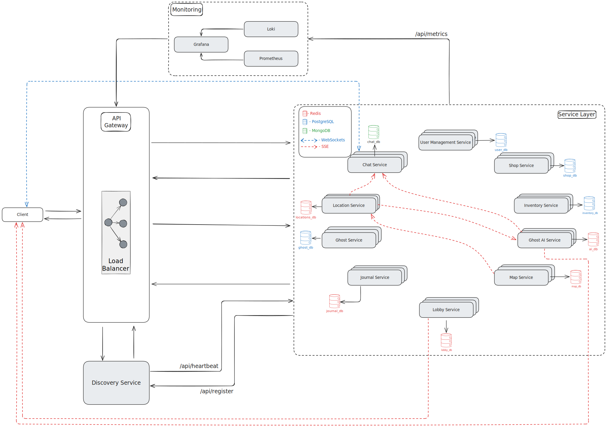

# Ghost Hunters - Game System

A ghost hunting game built with microservices architecture for the PAD (Parallel and Distributed Programming) laboratory work at FAF, Technical University of Moldova.

## Table of Contents

- [Project Overview](#project-overview)
- [Team](#team)
- [Service Boundaries](#service-boundaries)
- [Architecture Diagram](#architecture-diagram)
- [Tech Stack](#tech-stack)
- [Communication Contracts](#communication-contracts)
- [API Endpoints](#api-endpoints)
- [Development Guidelines](#development-guidelines)
- [Project Management](#project-management)
- [License](#license)

## Project Overview

Ghost Hunters is a multiplayer game, inspired by Phasmaphobia, that uses a microservices-oriented architecture. Players form teams to investigate haunted locations, gather evidence about supernatural entities and identify ghost types to earn currency in the game. The system handles real-time gameplay for multiple concurrent lobbies, with dynamic ghost AI, inventory management, location-based communication and game session tracking.

## Team

| Member                                                    | Service 1         | Service 2        |
| --------------------------------------------------------- | ----------------- | ---------------- |
| [Negai Marin](https://github.com/MarinBizarreAdventure)   | Ghost Service     | Location Service |
| [Gusev Roman](https://github.com/Ghenntoggy1)             | Shop Service      | Journal Service  |
| [Balamatiuc Eduard](https://github.com/eduard-balamatiuc) | Lobby Service     | Map Service      |
| [Plămădeală Maxim](https://github.com/grumpycatyo-collab) | User Service      | Ghost AI Service |
| [Vornic Daniela](https://github.com/danielavornic)        | Inventory Service | Chat Service     |

## Getting Started

### Docker Images
Below are displayed each service API image that are referenced in `docker-compose.yaml`, alongside with link reference to DockerHub tags page, where all images are hosted.
#### User Management Service
* [grumpycatyocollab/user-management-api:latest](https://hub.docker.com/r/grumpycatyocollab/user-management-api/tags)

#### Ghost AI Service
* [grumpycatyocollab/ghost-ai-api:latest](https://hub.docker.com/r/grumpycatyocollab/ghost-ai-api/tags)

#### Journal Service
* [ghenntoggy/journal-service:latest](https://hub.docker.com/r/ghenntoggy/journal-service/tags)

#### Shop Service
* [ghenntoggy/shop-service:latest](https://hub.docker.com/r/ghenntoggy/shop-service/tags)

#### Lobby Service
* [eduardbalamatiuc/lobby-service:latest](https://hub.docker.com/r/eduardbalamatiuc/lobby-service/tags)

#### Map Service
* [eduardbalamatiuc/map-service:latest](https://hub.docker.com/r/eduardbalamatiuc/map-service/tags)

#### Chat Service
* [danielavornic/ghost-hunters-chat-service:latest](https://hub.docker.com/r/danielavornic/ghost-hunters-chat-service/tags)

#### Inventory Service
* [danielavornic/ghost-hunters-inventory-service:latest](https://hub.docker.com/r/danielavornic/ghost-hunters-inventory-service/tags)

#### Ghost Service
* [marinbizzareadventrue/ghost-service:v1.1.0](https://hub.docker.com/r/marinbizzareadventrue/ghost-service/tags)

#### Location Service
* [marinbizzareadventrue/location-service:v1.2.0](https://hub.docker.com/r/marinbizzareadventrue/location-service/tags)

### Requirements
* `.env` setup according to `.env.template`
  
  * Make sure to set up passwords for each password-related field
  * Default ports are set up in `.env.template`

* Docker Engine or Docker Desktop
* Command-Line Interpreter (`sh`/`bash`/`cmd`/`powershell`)
* Insomnia or Postman - for endpoints testing
* Supported OS:
  * Linux Distributions
  * MacOS
  * Windows with WSL2

### How to Run
1. Clone the repository
```sh
git clone --branch main https://github.com/eduard-balamatiuc/faf-pad-ghost-hunters.git
```
2. Change directory to the one where you cloned the repository:
```sh
cd <repository_local_location>
```
2. Open CLI (sh/bash/cmd/powershell)
3. Run command:
```sh
docker-compose up -d
```
or
```sh
docker-compose up
```
4. Open Insomnia or Postman

If Insomnia is used 

  4.1. Import Collections from `_collections` folder

If Postman is used

  4.1. In Postman, click Import > Migrate to Postman > Other API Clients.
  4.2. Click `Select data to migrate` option
  4.3. Choose files from `_collections` folder
  4.4. Click `Start Migration`

5. You'll have to modify the ports from the `.env.template` since some of them might intersect.

6. If other Ports were specified in `.env`, you may require to manually change the base URLs in Postman/Insomnia endpoints.

## Database Seeding

Database seeding is handled differently across services:

- **Automated Seeding**: For all services except Inventory and Chat, the database is automatically seeded with initial data when the database is empty. This happens during the first startup of the service containers.

- **Manual Seeding**: For Inventory and Chat services, seeding must be done manually after the containers are running. Use the following commands:

  ```bash
  docker compose exec inventory-service pnpm run db:seed
  docker compose exec chat-service pnpm run db:seed
  ```

  Run these commands after starting the services with `docker-compose up` to populate the databases with necessary initial data.

## Service Boundaries

### User Management Service

Microservice responsible for every user and it’s data (email, password, currency, level, friends). Responsible for authentication and security, while also having a friends system that manages users friends. The service doesn’t communicate with any other service except the Inventory for doing transactions.

### Ghost AI Service

The brains of the game aka the AI Service is responsible for dictating the ghosts actions based on the map, player behavior and their sanity level, difficulty and ghost types. It heavily relies on multi-threading since each ghost needs to work in a separate thread, that’s why it has Rust as his language. Consumes data from practically all services and mostly communicates with the Location Service using queues, because of their reactivity and functionality.

### Shop Service

Microservice responsible for handling available shop items, presenting to players:

1. Item Title - title of the item (e.g. “_Candle_”),
2. Description - description of the corresponding item (e.g. “_Candle is a ghost-provocative tool that is used to gather evidences and track possible presence of the Ghost on the Map_.”),
3. Durability - the number of sessions in which the item can be used or the number of usages during the session (e.g. Candle have a durability of “_1 Usage_”, respectively one usage per session, or Radio has durability “_10 seconds_”),
4. Price - the amount of in-game currency that is required to spend to procure the corresponding item (e.g. “_Candle Price: 100$_”).

This components uses services personal Database - `shop_db` , which contains information about each item details, mentioned previously.

This Service communicates with **Inventory Service**, responsible for each individual player available items to be used. **Shop Service** will send information about the available shop item(s) by the player in JSON Serialization Format upon requests from **Inventory Service**. Besides that, filtering based on the category tag is done on this service’s side.

### Journal Service

Microservice responsible to provide to players a way to record symptoms manifested by the Ghost during the game by selecting from the list of all possible symptoms 3 specific symptoms that are considered to be manifested by the Ghost during the on-going game.

Besides this, Journal Service will display the available symptoms from the Ghost Service, that holds information about every Ghost behavior and identification methods, that are displayed to players during the game to make notes and choose the Ghost Type when they decide to fininsh the investigation.

Also, Journal Service is responsible for the evaluation of the correctness of players guesses, rewarding them based on coincidences between chosen by the players set of symptoms and on-going Ghost Type true symptoms.

This service employs several other services:

1. **User Management Service** - to award in-game players accordingly based on the correctness of their guesses.
2. **Ghost Service** - to retrieve all possible symptoms of each ghost and validate against true Ghost type symptoms.
3. **Lobby Service** - to get the current in-game actual Ghost type.

### Lobby Service

Microservice responsible for gathering all the information about the game session and keep track of it till the end of the game session, making it the source of truth, with data like:

- Players participating in the session
  - Items brought
  - Sanity level
  - Death status
- The difficulty level
- Ghost type
- Chosen map

This service will be interacting with the Gateway through any change.

And all other game session related services like Location Service and Ghost AI Service will be using the game status information as the truth source.

### Map Service

Keeps track of the entire game map state throughout each game session. It will track the rooms and all objects inside them with a validation if the ghost interacted with the object or not and by which tool this validation can be triggered by the player, also the available hiding spots and their accessibility by their ghosts. Nevertheless the connections between each available rooms.

The Map service will automatically generate map configurations with different room placements, and objects.

Core functionality will come as help for Ghost AI Service and Location Service to enable them to interact with the map, and objects and inform them about the ghosted status of each object.

### Ghost Service

Acts as the authoritative encyclopedia for all supernatural entities, managing ghost type definitions. Stores Type A symptoms (directly observable: EMF readings, temperature drops) and Type B symptoms (behavioral patterns: hunting triggers, group dynamics).

Core functions include providing behavioral templates to the Ghost AI Service and Journal Service.

Key responsibilities:

- Static ghost type encyclopedia and symptom database
- Behavioral rule templates for AI decision-making

### Location Service

Maintains real-time spatial awareness for all players, tracking positions, interactions, and contextual states (hiding, speaking, grouping). Processes high-frequency location updates and provides proximity-based queries with microsecond precision.

Serves Chat Service with room occupancy data, streams real-time positions to Ghost AI Service for hunting algorithms, and tracks object interactions for Inventory Service. Validates spatial relationships through Map Service integration.

Key responsibilities:

- Real-time position tracking and state management
- Object interaction logging and room occupancy

### Inventory Service

Manages all equipment and items owned by player within the game: time of purchase, price, remaining durability. When players use equipment during ghost hunting sessions, the service decreases durability and removes items when they break.

It connects with the Shop Service where players buy new items and with the Lobby Service to handle item usage during active games. It also provides equipment status information to other services, such as radio availability for Chat.

### Chat Service

Offers communication between based on their location. Players in the same room can talk to each other through text messages, while players with radio equipment can communicate across different rooms (unless a ghost is actively haunting the area).

As such, the service filters messages based on player locations, manages radio connectivity and ensures that supernatural events can interrupt communications.

It integrates with the Location Service to determine who can talk to whom, with the User Management Service to authenticate players and with the Inventory Service to verify radio equipment status.

## Architecture Diagram

The following diagram illustrates the microservices architecture with API Gateway, load balancer, and service communication patterns:



## Tech Stack

### Programming Languages & Justification

#### Go

Used for Ghost Service, Location Service, Map Service, Lobby Service, User Management Service and Journal Service. Strong typing ensures data validation accuracy, built-in JSON marshaling handles complex ghost data structures efficiently, and Go's simplicity reduces development overhead for validation-focused operations. Goroutines and channels are essential for handling real-time position tracking with microsecond precision, while built-in concurrency primitives allow efficient processing of high-frequency location updates from multiple players simultaneously.

#### Rust

Used for Ghost AI Service. Rust compiles to highly efficient native code, so the “AI” logic will have very low latencies. Also it quite sensationally deals with data races because of its architecture which is perfect for the case of multi-threading.

#### Typescript

Used for Chat Service, Inventory Service and Shop Service. It is a great choice since TypeScript is a typed language, which helps in handling complex data structures and preventing runtime errors. Using Nest.js, a Node.js framework built on TypeScript, the project benefits from built-in WebSocket support for the chat app, validation pipes for data handling and overall a modular architecture.

### Databases

#### PostgreSQL

- Inventory service `inventory_db`: For structured data with strong consistency requirements. Handles item ownership relationships, transaction history and durability tracking where data integrity is important.
- Shop Service `shop_db` : Since data in Shop is fixed and Items have a common strict structure and price history is recorded inside of a table in the DB, Relational Database - PostgreSQL, provides a way to enforce strict policy on contained data in it.
- Ghost Service `ghost_db`: Relational structure perfectly fits the ghost type hierarchy with symptoms, behavioral rules, and validation logic. JSONB fields can store flexible behavioral templates for the AI service.
- User Service `user_db` : Since it’s a classic user DB, Postgres would be the best choice for its wide popularity, maintainability and forums.

#### MongoDB

- Chat Service: For flexible message storage with various metadata (timestamps, room info, radio status). Supports queries for room-based message fetching and handles different message types without schema constraints.

#### Redis

- Location Service `locations_db`: for high-frequency operations - storing current player positions, room occupancy, and real-time state data with sub-millisecond access times. Essential for handling simultaneous location updates from hundreds of players without bottlenecks.
- Ghost AI Service `ai_db` : since the ghost are recorded only session-wise, and some info can be optimized via caching, Redis would be the best option.
- Lobby Service `lobby_db`: for transient session management - storing player lists, game settings, and real-time readiness status with extremely low-latency read/write access. Essential for managing thousands of concurrent pre-game lobbies and broadcasting instant updates to all players.
- Map Service `map_db`: for real-time game state tracking - storing dynamic object states (e.g., `is_ghosted`) and live data with millisecond-level update propagation. Essential for synchronizing the game world state for all players and the Ghost AI Service during an active session.
- Journal Service `journal_db`: for real-time journal entries handling - storing session-wise for each player their entries both for ghost type and symptoms. Useful to maintain the currently noted-down entries by each user.

### Communication Patterns

#### REST APIs

REST APIs for standard service-to-service communication, providing simple HTTP-based integration for most business operations.

#### PubSub with RabbitMQ

Leveraged by Location and Ghost Services for effective communication, since one is responsible for the users and another one for the ghosts, fast messages and exchanged info is critical.

## Communication Contracts

### User Management Service

#### Consumed API Endpoints

`None` - User Management Service is primarily a data provider and authentication service.

#### Exposed API Endpoints

- `POST /users/register` - Consumed by Gateway
  - Description
    Creates a new user account with initial currency allocation. A user starts with some currency (`100`).
  - Payload
    ```json
    {
      "email": "player@example.com",
      "username": "PlayerOne",
      "password": "SecurePassword123"
    }
    ```
  - Response
    ```json
    {
      "user": {
        "id": "uuid-here",
        "email": "player@example.com",
        "username": "PlayerOne",
        "currency": 100,
        "level": 1,
        "createdAt": "2025-09-09T10:00:00Z"
      },
      "accessToken": "jwt-token-here"
    }
    ```
- `POST /users/login` - Consumed by Gateway
  - Description
    Authenticates existing users and returns access tokens.
  - Payload
    ```json
    {
      "email": "player@example.com",
      "password": "SecurePassword123"
    }
    ```
  - Response
    ```json
    {
      "user": {
        "id": "uuid-here",
        "email": "player@example.com",
        "username": "PlayerOne",
        "level": 5,
        "currency": 2500,
        "lastLogin": "2025-09-09T10:00:00Z"
      },
      "accessToken": "jwt-token-here",
      "refreshToken": "refresh-token-here"
    }
    ```
- `POST /users/refresh` - Consumed by Gateway
  - Description
    Generates new access tokens without requiring re-authentication.
  - Payload
    ```json
    {
      "refreshToken": "refresh-token-here"
    }
    ```
  - Response
    ```json
    {
      "accessToken": "new-jwt-token-here",
      "expiresIn": 3600,
      "refreshToken": "refresh-token-here",
      "refreshExpiresIn": 1800000
    }
    ```
- `PUT /users/{userId}/profile` - Consumed by Gateway
  - Description
    Updates profile info (username/email). Changes should be limited.
  - Payload
    ```json
    {
      "username": "NewPlayerName",
      "email": "newemail@example.com"
    }
    ```
  - Response
    ```json
    {
      "message": "Profile updated successfully",
      "user": {
        "id": "uuid-here",
        "email": "newemail@example.com",
        "username": "NewPlayerName",
        "level": 5,
        "currency": 2500
      }
    }
    ```
- `DELETE /users/{userId}/account` - Consumed by Gateway
  - Description
    Deletes a user account, with a grace period for recovery.
  - Payload
    ```json
    {
      "password": "SecurePassword123",
      "confirmation": "DELETE"
    }
    ```
  - Response
    ```json
    {
      "message": "Account successfully deleted"
    }
    ```
- `GET /users/{userId}/currency` - Consumed by Gateway, Inventory Service
  - Description
    Returns the current balance and transaction history.
  - Payload
    ```json
    None
    ```
  - Response
    ```json
    {
      "balance": 2500
    }
    ```
- `POST /users/{userId}/currency/transactions` - Consumed by Inventory Service
  - Description
    Processes purchases, rewards, or transfers.
  - Payload (Purchase)
    ```json
    {
      "type": "purchase",
      "amount": 150
    }
    ```
  - Payload (Transfer)
    ```json
    {
      "type": "transfer",
      "amount": 100
    }
    ```
  - Payload (Reward)
    ```json
    {
      "type": "reward",
      "amount": 100,
      "expGained": 1030 // User levels up every 1000 exp (if 1000 exp is gained, level increases by 1)
    }
    ```
  - Response
    ```json
    {
      "transactionStatus": "success"
    }
    ```
- `POST /users/{userId}/friends/request` - Consumed by Gateway
  - Description
    Sends a friend request.
  - Payload
    ```json
    {
      "recipientUsername": "FriendUsername"
    }
    ```
  - Response
    ```json
    {
      "request": {
        "id": "request-uuid",
        "recipientId": "friend-uuid",
        "recipientUsername": "FriendUsername",
        "status": "pending",
        "sentAt": "2025-09-09T10:00:00Z"
      }
    }
    ```
- `GET /users/{userId}/friends/requests` - Consumed by Gateway
  - Description
    Gets incoming and outgoing friend requests.
  - Payload
    ```json
    None
    ```
  - Response
    ```json
    {
      "incoming": [
        {
          "id": "request-uuid",
          "senderId": "sender-uuid",
          "senderUsername": "SenderName",
          "sentAt": "2025-09-09T09:00:00Z"
        }
      ],
      "outgoing": [
        {
          "id": "request-uuid-2",
          "recipientId": "recipient-uuid",
          "recipientUsername": "RecipientName",
          "sentAt": "2025-09-09T08:00:00Z"
        }
      ]
    }
    ```
- `POST /users/{userId}/friends/respond` - Consumed by Gateway
  - Description
    Accepts or rejects a friend request.
  - Payload
    ```json
    {
      "requestId": "request-uuid",
      "action": "accept"
    }
    ```
  - Response
    ```json
    {
      "message": "Friend request accepted",
      "friend": {
        "id": "friend-uuid",
        "username": "NewFriend",
        "level": 3,
        "isOnline": true,
        "friendshipDate": "2025-09-09T10:00:00Z"
      }
    }
    ```
- `GET /users/{userId}/friends/list` - Consumed by Gateway
  - Description
    Returns all confirmed friends with online status.
  - Payload
    ```json
    None
    ```
  - Response
    ```json
    {
      "friends": [
        {
          "id": "friend-uuid",
          "username": "BestFriend",
          "level": 8,
          "isOnline": true,
          "lastSeen": "2025-09-09T10:00:00Z",
          "friendshipDate": "2025-08-15T14:30:00Z"
        },
        {
          "id": "friend-uuid-2",
          "username": "OldFriend",
          "level": 12,
          "isOnline": false,
          "lastSeen": "2025-09-08T20:15:00Z",
          "friendshipDate": "2025-07-22T11:45:00Z"
        }
      ],
      "total": 12,
      "onlineCount": 4
    }
    ```
- `DELETE /users/{userId}/friends/remove` - Consumed by Gateway
  - Description
    Removes a friend.
  - Payload
    ```json
    {
      "friendId": "friend-uuid"
    }
    ```
  - Response
    ```json
    {
      "message": "Friendship ended successfully"
    }
    ```

### Ghost AI Service

#### Consumed API Endpoints

- `PUT /lobbies/{lobbyId}/users/{userId}/status` - Available in Lobby Service
  - Description
    Updates a player's status (e.g., sanity drop, death) based on ghost interactions.
- `GET /map/{mapId}` - Available in Map Service
  - Description
    Retrieves the full, current map state for a specific, active lobby session to inform ghost movement and interaction decisions.
- `PUT /map/{mapId}/rooms/{roomId}/objects/{objectName}` - Available in Map Service
  - Description
    Updates the state of an object within a room (e.g., marking it as ghosted) during ghost interactions.
- `GET /ghost/types` - Available in Ghost Service
  - Description
    Retrieves all available ghost types with their associated symptoms for AI behavior initialization.
- `GET /ghost/{ghostId}/behavior` - Available in Ghost Service
  - Description
    Gets behavioral rules and templates for AI decision-making based on the specific ghost type.
- `GET /location/{lobbyId}/users/{userId}/current` - Available in Location Service
  - Description
    Gets detailed user status and position information (only for alive players) to inform ghost hunting behavior.
- `DELETE /location/{lobbyId}/users/{userId}` - Available in Location Service
  - Description
    Removes dead players from location tracking when the ghost kills them.

#### Exposed API Endpoints

- `POST /ai/start` - Consumed by Lobby Service
  - Description
    Starts a new ghost AI thread for a specific lobby session with the provided configuration.
  - Payload
    ```json
    {
      "lobbyId": "lobby_xyz_789",
      "hostId": "player_host_123",
      "mapId": "map_id_farmhouse_123",
      "difficulty": "medium",
      "ghostType": "demon",
      "session": "active",
      "players": ["player_1", "player_2"]
    }
    ```
  - Response
    ```json
    {
      "status": "started",
      "ghostThreadId": "ghost_thread_123",
      "lobbyId": "lobby_xyz_789"
    }
    ```
- `POST /ai/end` - Consumed by Lobby Service
  - Description
    Terminates the ghost AI thread for a specific lobby session when the game ends.
  - Payload
    ```json
    {
      "lobbyId": "lobby_xyz_789"
    }
    ```
  - Response
    ```json
    {
      "status": "terminated",
      "lobbyId": "lobby_xyz_789"
    }
    ```

#### Message Queue Events

- `PUBLISH ghost_updates` - Published to RabbitMQ, Consumed by Location Service, Chat Service
  - Description
    Publishes real-time ghost status updates across all services for coordinated game state management.
  - Payload
    ```json
    {
      "lobbyId": "lobby_xyz_789",
      "eventType": "huntStarted",
      "ghostLocation": "kitchen_01",
      "timestamp": "2025-09-09T10:00:00Z"
    }
    ```
- `SUBSCRIBE user_updates_{lobbyId}` - Published by Location Service
  - Description
    Receives player status and movement updates to inform ghost AI decision-making and hunting behavior.
  - Payload
    ```json
    {
      "userId": "player_1",
      "location": "hallway_01",
      "action": "speaking",
      "sanityLevel": 65,
      "timestamp": "2025-09-09T10:00:00Z"
    }
    ```

### Shop Service

#### Consumed API Endpoints

`None` - Shop Service is primarily a data provider for item catalog information.

#### Exposed API Endpoints

- `GET /shop/items` - Consumed by Inventory Service
  - Description
    Retrieves all shop items or filtered items by category. Supports optional category query parameter for filtering.
  - Query Parameters
    - `category` (optional): Category type used for filtering shop items (e.g., "INVESTIGATIVE", "PROTECTIVE")
  - Payload
    ```json
    None
    ```
  - Response (All items)
    ```json
    {
      "shopItems": [
        {
          "id": "emf",
          "title": "EMF Reader",
          "description": "Measures EMF Level.",
          "category": "INVESTIGATIVE",
          "durability": 5,
          "price": 50
        },
        {
          "id": "crucifix",
          "title": "Crucifix",
          "description": "Prevents Ghost Attacks.",
          "category": "PROTECTIVE",
          "durability": 3,
          "price": 150
        },
        {
          "id": "radio",
          "title": "Radio",
          "description": "Enables communication across rooms.",
          "category": "COMMUNICATION",
          "durability": 10,
          "price": 150
        }
      ]
    }
    ```
  - Response (Filtered by category: `?category=INVESTIGATIVE`)
    ```json
    {
      "shopItems": [
        {
          "id": "emf",
          "title": "EMF Reader",
          "description": "Measures EMF Level.",
          "category": "INVESTIGATIVE",
          "durability": 5,
          "price": 50
        },
        {
          "id": "salt",
          "title": "Salt",
          "description": "Salt used to track ghost footprints.",
          "category": "INVESTIGATIVE",
          "durability": 4,
          "price": 100
        },
        {
          "id": "uvLight",
          "title": "UV Light",
          "description": "Ultra-Violet Light that is used to highlight fingerprints and footprints",
          "category": "INVESTIGATIVE",
          "durability": 10,
          "price": 120
        }
      ]
    }
    ```
- `GET /shop/categories` - Consumed by Inventory Service
  - Description
    Retrieves all available shop item categories for filtering and organization purposes.
  - Payload
    ```json
    None
    ```
  - Response
    ```json
    {
      "categories": [
        "INVESTIGATIVE",
        "PROTECTIVE",
        "COMMUNICATION",
        "CONSUMABLES"
      ]
    }
    ```
- `GET /shop/items/{itemId}` - Consumed by Inventory Service
  - Description
    Retrieves detailed information about a specific shop item by its ID.
  - Path Parameters
    - `itemId`: Unique identifier of the shop item
  - Payload
    ```json
    None
    ```
  - Response
    ```json
    {
      "id": "emf",
      "title": "EMF Reader",
      "description": "Measures EMF Level.",
      "category": "INVESTIGATIVE",
      "durability": 5,
      "price": 50
    }
    ```

### Journal Service

#### Consumed API Endpoints

- `GET /ghost/list` - Available in Ghost Service
  - Description
    Get all available ghost types in simplified format.
  - Payload
    ```json
    None
    ```
  - Response
    ```json
    {
      "ghosts": [
        {
          "id": "poltergeist",
          "name": "Poltergeist"
        },
        {
          "id": "demon",
          "name": "Demon"
        },
        {
          "id": "spirit",
          "name": "Spirit"
        },
        ...
        {
          "id": "wraith",
          "name": "Wraith"
        }
      ]
    }
    ```
- `GET /ghost/symptoms` - Available in Ghost Service
  - Description
    Get all available symptoms.
  - Payload
    ```json
    None
    ```
  - Response
    ```json
    {
      "symptoms": [
        {
          "id": "emfFive",
          "name": "EMF Level 5",
          "type": "typeA",
          "description": "Electromagnetic field readings at maximum level"
        },
        {
          "id": "objectsThrown",
          "name": "Objects Thrown",
          "type": "typeA",
          "description": "Physical objects being moved or thrown"
        },
        {
          "id": "coldTemperatures",
          "name": "Freezing Temperatures",
          "type": "typeA",
          "description": "Room temperature drops below freezing"
        },
        ...
        {
          "id": "huntsAlonePlayers",
          "name": "Hunts Alone Players",
          "type": "typeB",
          "description": "Preferentially targets isolated players"
        }
      ]
    }
    ```
- `GET /ghost/types` - Available in Ghost Service
  - Description
    Get all available ghost types with symptoms.
  - Payload
    ```json
    None
    ```
  - Response
    ```json
    {
      "ghosts": [
        {
          "id": "poltergeist",
          "name": "Poltergeist",
          "typeASymptoms": ["emfFive", "coldTemperatures", "ghostWriting"],
          "typeBSymptoms": ["objectsThrown", "huntsLowSanity"],
          "description": "Aggressive ghost that manipulates objects"
        },
        ...
        {
          "id": "demon",
          "name": "Demon",
          "typeASymptoms": ["emfFive", "fingerprints", "ghostWriting"],
          "typeBSymptoms": ["objectsThrown", "huntsHighSanity"],
          "description": "Aggressive ghost that manipulates objects"
        }
      ]
    }
    ```
- `GET /lobbies/{lobby_id}/ghost` - Available in Lobby Service
  - Path Parameters

    `lobby_id`- ID of the Session from which the true type of the Ghost is requested.

  - Description
    Retrieve the true Ghost Type from Lobby Service.
  - Payload
    ```json
    None
    ```
  - Response
    ```json
    {
      "lobbyId": "lobby123",
      "trueGhostId": "demon"
    }
    ```

- `PUT /users/{user_id}/currency/transactions` - Available in User Management Service
  - Path Parameters

    `user_id` - ID of the User that should be rewarded.

  - Description
    Update Balance and Level of the Player according to the correctness of the predictions.
  - Payload
    ```json
    {
      "type": "reward",
      "amount": 70,
      "expGained": 50
    }
    ```
  - Response
    ```json
    {
      "transactionStatus": "success"
    }
    ```

#### Exposed API Endpoints

- `POST /journal/users/{user_id}/entry/symptoms` - Consumed by Gateway
  - Path Parameters:

    `user_id` - ID of the User that calls this endpoint in order to select symptoms from the general pool of all possible symptoms.

  - Description
    User selects the symptoms from the list of available symptoms and receives output based on the difficulty: Easy - filters ghosts that match at least two of the selected symptoms, Medium - filters ghosts that match at least one of the selected symptoms, Hard - no filtering is applied.
  - Payload
    ```json
    {
      "lobbyId": "lobby123",
      "typeASymptoms": ["freezingTemperature"],
      "typeBSymptoms": []
    }
    ```
  - Response (Easy Difficulty - filters ghosts that match at least two of the selected symptoms)
    ```json
    {
      "lobbyId": "lobby123",
      "typeASymptoms": ["freezingTemperature", "emfFive"],
      "typeBSymptoms": [],
      "ghostType": [
        {
          "id": "demon",
          "name": "Demon"
        },
        {
          "id": "obake",
          "name": "Obake"
        }
      ]
    }
    ```
  - Response (Medium Difficulty - filters ghosts that match at least one of the selected symptoms)
    ```json
    {
      "lobbyId": "lobby123",
      "typeASymptoms": ["freezingTemperature", "emfFive"],
      "typeBSymptoms": [],
      "ghostType": [
        {
          "id": "demon",
          "name": "Demon"
        },
        {
          "id": "spirit",
          "name": "Spirit"
        },
        {
          "id": "obake",
          "name": "Obake"
        }
      ]
    }
    ```
  - Response (Hard Difficulty - returns all selected symptoms and ghosts)
    ```json
    {
      "lobbyId": "lobby123",
      "typeASymptoms": ["freezingTemperature", "emfFive"],
      "typeBSymptoms": [],
      "ghostType": [
        {
          "id": "demon",
          "name": "Demon"
        },
        ...
        {
          "id": "obake",
          "name": "Obake"
        }
      ]
    }
    ```

- `POST /journal/users/{user_id}/entry/ghost` - Consumed by Gateway
  - Path Parameters:

    `user_id` - ID of the User that calls this endpoint in order to select Ghost Type from the general pool of all possible Ghost Types.

  - Description
    User selects the ghost type from the list of available types and receives output based on the choice and according to Ghost Service Encyclopedia.
  - Payload
    ```json
    {
      "lobbyId": "lobby123",
      "ghostType": "demon"
    }
    ```
  - Response
    ```json
    {
      "lobbyId": "lobby123",
      "typeASymptoms": ["freezingTemperature", "fingerprints", "usesRadio", "ghostWriting"],
      "typeBSymptoms": ["huntsAlonePlayers", "huntsLowSanity"],
      "ghostType": {
          "id": "demon",
          "name": "Demon"
        }
    }
    ```

- `POST /journal/users/{user_id}/submit` - Consumed by Gateway
  - Path Parameters:

    `user_id` - ID of the User that calls this endpoint in order to submit the selected Ghost Type and Symptoms from the general pool of all possible Ghost Types and Symptoms.

  - Description
    User submits the selected Ghost Type and Symptoms and receives output based on the choice and according to Ghost Service Encyclopedia, as well as the reward in money and experience.
  - Payload
    ```json
    {
      "lobbyId": "lobby123",
      "ghostType": "demon",
      "typeASymptoms": ["emfFive", "objectsThrown", "coldTemperatures"],
      "typeBSymptoms": ["huntsAlonePlayers", "aggressiveWhenProvoked"]
    }
    ```
  - Response
    ```json
    {
      "lobbyId": "lobby123",
      "isCorrectType": true,
      "trueType": {
        "id": "demon",
        "name": "Demon"
      },
      "submittedType": {
        "id": "demon",
        "name": "Demon"
      },
      "accuracyScore": 60,
      "rewardMoney": 70,
      "rewardExp": 50,
      "explanation": "Correctly identified with 3/5 symptoms observed",
      "correctSymptoms": ["emfFive", "objectsThrown", "aggressiveWhenProvoked"],
      "incorrectSymptoms": ["huntsAlonePlayers", "freezingTemperatures"],
      "missedSymptoms": ["huntsHighSanity", "usesRadio"]
    }
    ```

- `GET /journal/lobbies/{lobby_id}/users/{user_id}/ghost/selected` - Consumed by Gateway
  - Path Parameters:

    `lobby_id` - ID of the lobby from where the Users select their ghost entry.

    `user_id` - ID of the User that calls this endpoint in order to get their ghost selection.

  - Description
    Gets currently selected ghost entry by User.
  - Payload
    ```json
    None
    ```
  - Response
    ```json
    {
      "lobbyId": "lobby123",
      "ghostType": {
        "id": "demon",
        "name": "Demon"
      }
    }
    ```

- `GET /journal/lobbies/{lobby_id}/users/{user_id}/symptoms/selected` - Consumed by Gateway
  - Path Parameters:

    `lobby_id` - ID of the lobby from where the Users select their symptoms entries.

    `user_id` - ID of the User that calls this endpoint in order to get their symptoms selection.

  - Description
    Gets currently selected symptoms entry by User.
  - Payload
    ```json
    None
    ```
  - Response
    ```json
    {
      "lobbyId": "lobby123",
      "typeASymptoms": [
        "freezingTemperature",
        "fingerprints",
        "usesRadio",
        "ghostWriting"
      ],
      "typeBSymptoms": ["huntsAlonePlayers", "huntsLowSanity"]
    }
    ```

- `POST /journal/start` - Consumed by **Lobby Service**
  - Description
    Starts a Journal thread in Journal Service.
  - Payload
    ```json
    {
      "lobbyId": "lobby_xyz_789",
      "hostId": "player_host_123",
      "mapId": "map_id_farmhouse_123",
      "difficulty": "medium",
      "ghostType": "demon",
      "session": "active",
      "players": ["player_1", "player_2"]
    }
    ```
  - Response
    ```json
    None
    ```
- `POST /journal/end` - Consumed by **Lobby Service**
  - Description
    Ends a Journal thread in Journal Service.
  - Payload
    ```json
    {
      "lobbyId": "lobby_xyz_789"
    }
    ```
  - Response

### Lobby Service

#### Consumed API Endpoints

- `GET /map` - Available in Map Service.
  **Description**: Retrieves a newly generated map for the player to interact with.
- `POST /ai/start` - Available in Ai Service.
  - Payload
    ```json
    {
      "lobbyId": "lobby_xyz_789",
      "hostId": "player_host_123",
      "mapId": "map_id_farmhouse_123",
      "difficulty": "medium",
      "ghostType": "demon",
      "session": "active",
      "players": ["player_1", "player_2"]
    }
    ```
    **Description:** Starts a ghost thread in AI Service
- `POST /ai/end` - Available in Ai Service.
  - Payload
    ```json
    {
      "lobbyId": "lobby_xyz_789"
    }
    ```
    **Description:** Ends a ghost thread in AI Service
- `POST /location/start` - Available in Location Service.
  - Payload
    ```json
    {
      "lobbyId": "lobby_xyz_789",
      "hostId": "player_host_123",
      "mapId": "map_id_farmhouse_123",
      "difficulty": "medium",
      "ghostType": "demon",
      "session": "active",
      "players": ["player_1", "player_2"]
    }
    ```
    **Description:** Starts a location session in Location Service.
- `POST /location/end` - Available in Location Service.
  - Payload
    ```json
    {
      "lobbyId": "lobby_xyz_789"
    }
    ```
    **Description: End** a location session in Location Service.
- `POST /journal/start` - Available in Journal Service.
  - Payload
    ```json
    {
      "lobbyId": "lobby_xyz_789",
      "hostId": "player_host_123",
      "mapId": "map_id_farmhouse_123",
      "difficulty": "medium",
      "ghostType": "demon",
      "session": "active",
      "players": ["player_1", "player_2"]
    }
    ```
    **Description:** Starts a Journal session in Journal Service.
- `POST /journal/end` - Available in Journal Service.
  - Payload
    ```json
    {
      "lobbyId": "lobby_xyz_789"
    }
    ```
    **Description: End** a Journal session in Journal Service.

#### Exposed API Endpoints

- `POST /lobbies` - Consumed by Game Client/Gateway.
  - Description
    Creates a new game lobby.
  - Payload
    ```json
    {
      "hostId": "user_1",
      "difficulty": "medium",
      "ghostType": "type-1"
    }
    ```
  - Response
    ```json
    {
      "lobbyId": "lobby_xyz_789",
      "hostId": "player_host_123",
      "mapId": "map_farmhouse_123",
      "difficulty": "medium",
      "ghostType": "type-1",
      "session": "inactive"
    }
    ```
- `GET /lobbies/{lobbyId}` - Consumed by Game Client/Gateway, Ghost AI Service, Location Service.
  - Description
    Retrieves the current state and settings of a specific lobby.
  - Payload
    ```json
    None
    ```
  - Response
    ```json
    {
      "lobbyId": "lobby_xyz_789",
      "hostId": "player_host_123",
      "mapId": "map_id_farmhouse_123",
      "difficulty": "medium",
      "ghostType": "demon",
      "session": "active",
      "players": ["player_1", "player_2"]
    }
    ```
- `POST /lobbies/{lobbyId}/start` - Consumed by Game Client/Gateway.
  - Description
    Starts the game with the current lobby configuration.
  - Payload
    ```json
    None
    ```
  - Response
    ```json
    200 OK
    ```
- `POST /lobbies/{lobbyId}/user` - Consumed by Game Client/Gateway.
  - **Description**
    Adds a player to the specific lobby.
  - Payload
    ```json
    {
      "userId": "user_2"
    }
    ```
  - Response
    ```json
    200 OK
    ```
- `DELETE /lobbies/{lobbyId}/users/{userId}` - Consumed by Game Client/Gateway
  - Description
    Removes a player from a lobby.
  - Payload
    ```json
    None
    ```
  - Response
    ```json
    200 OK
    ```
- `PUT /lobbies/{lobbyId}/users/{userId}` - Consumed by Game Client/Gateway
  - Description
    Updates a player’s loadout (items brought into the session).
  - Payload
    ```json
    {
      "items": [{ "itemId": "tempReader" }, { "itemId": "camera" }]
    }
    ```
  - Response
    ```json
    200 OK
    ```
- `GET /lobbies/{lobbyId}/users` - Consumed by Location Service, Game Client
  - Description
    Gets a list of all players currently in the lobby.
  - Payload
    ```json
    None
    ```
  - Response
    ```json
    {
      "lobbyId": "lobby_xyz_789",
      "users": ["user_1", "user_2", "user_3"]
    }
    ```
- `GET /lobbies/{lobbyId}/users/{userId}/status` - Consumed by Location Service
  - Description
    Gets a specific player’s status, including sanity and death state.
  - Payload
    ```json
    None
    ```
  - Response
    ```json
    {
      "deathStatus": false,
      "sanityLevel": 85
    }
    ```
- `PUT /lobbies/{lobbyId}/users/{userId}/status` - Consumed by Ghost AI Service, Location Service
  - Description
    Update a player’s status (e.g., sanity drop, death).
  - Payload
    ```json
    {
      "deathStatus": true, // optional
      "sanityLevel": 0 // optional
    }
    ```
  - Response
    ```json
    200 OK
    ```
- `GET /lobbies/{lobbyId}/ghost` - Consumed by Journal Service
  - Description
    Retrieves the true ghost type for a given session for validation.
  - Payload
    ```json
    None
    ```
  - Response
    ```json
    {
      "lobbyId": "lobby_xyz_789",
      "trueGhostId": "demon"
    }
    ```
- `GET  /lobbies/{lobbyId}/users/{userId}/items` - Consumed by Location Service, Chat Service
  `/lobby/{lobbyId}/users/{userId}/items`
  - Description
    Retrieves all the items available to the player provided.
  - Payload
    ```json
    None
    ```
  - Response
    ```json
    {
      "items": [{ "itemId": "emf" }, { "itemId": "crucifix" }]
    }
    ```

### Map Service

#### Consumed API Endpoints

`None` - Map Service is a data provider.

#### Exposed API Endpoints

- `GET /map` - Consumed by Lobby Service
  - Description
    Retrieves a newly generated map for the player to interact with.
  - Payload
    ```json
    None
    ```
  - Response
    ```json
    {
      "mapId": "map_farmhouse_123",
      "name": "User's Custom Farmhouse"
    }
    ```
- `GET /map/{mapId}` - Consumed by Game Client, Ghost AI Service
  - Description
    Retrieves the full, current map state for a specific, active lobby session.
  - Payload
    ```json
    None
    ```
  - Response
    ```json
    {
      "mapId": "map_farmhouse_123",
      "name": "User's Custom Farmhouse",
      "rooms": [
        {
          "roomId": "kitchen_01",
          "name": "Kitchen",
          "connections": ["hallway_01", "dining_room_01"],
          "objects": [
            { "name": "Fridge", "isGhosted": true, "trigger": "any" },
            { "name": "Sink", "isGhosted": false, "trigger": "uvLamp" }
          ],
          "hidingPlaces": [{ "name": "Pantry", "isGhostAccessible": false }]
        }
      ]
    }
    ```
- `GET /map/{mapId}/rooms/{roomId}` - Consumed by Location Service
  - Location
    Gets specific room data for the current map.
  - Payload
    ```json
    None
    ```
  - Response
    ```json
    {
      "roomId": "kitchen_01",
      "name": "Kitchen",
      "connections": ["hallway_01"],
      "objects": [
        { "name": "Fridge", "isGhosted": true, "trigger": "any" },
        { "name": "Sink", "isGhosted": false, "trigger": "uvLamp" }
      ],
      "hidingPlaces": [{ "name": "Pantry", "isGhostAccessible": false }]
    }
    ```
- `PUT /map/{mapId}/rooms/{roomId}/objects/{objectName}` - Consumed by Ghost AI Service
  - Description
    Updates the state of an object within a room for a the specific map.
  - Payload
    ```json
    {
      "isGhosted": true
    }
    ```
  - Response
    ```json
    200 OK
    ```

### Ghost Service

#### Consumed API Endpoints

`None` - Ghost Service is primarily a data provider and reference service.

#### Exposed API Endpoints

- `GET /ghost/types` - Consumed by Journal Service, Gateway, Ghost AI Service
  - Description
    Retrieves all available ghost types with their associated symptoms for AI behavior initialization and journal validation.
  - Payload
    ```json
    None
    ```
  - Response
    ```json
    {
      "ghosts": [
        {
          "id": "poltergeist",
          "name": "Poltergeist",
          "typeASymptoms": ["emfFive", "objectsThrown", "coldTemperatures"],
          "typeBSymptoms": ["huntsAlonePlayers", "aggressiveWhenProvoked"],
          "description": "Aggressive ghost that manipulates objects"
        },
        {
          "id": "demon",
          "name": "Demon",
          "typeASymptoms": ["emfFive", "fingerprints", "ghostWriting"],
          "typeBSymptoms": ["objectsThrown", "huntsHighSanity"],
          "description": "Extremely aggressive entity with high hunting frequency"
        }
      ]
    }
    ```
- `GET /ghost/{ghostId}/behavior` - Consumed by Ghost AI Service
  - Description
    Gets behavioral rules and templates for AI decision-making based on the specific ghost type.
  - Payload
    ```json
    None
    ```
  - Response
    ```json
    {
      "ghostId": "poltergeist",
      "huntingTriggers": ["sanityBelow50", "playerAlone", "provokedByObjects"],
      "abilities": ["throwObjects", "manipulateElectronics", "temperatureDrop"],
      "huntingCooldown": 30000,
      "aggressionLevel": "high"
    }
    ```
- `GET /ghost/symptoms` - Consumed by Journal Service, Location Service
  - Description
    Get all available symptoms categorized by type for game mechanics and validation.
  - Payload
    ```json
    None
    ```
  - Response
    ```json
    {
      "symptoms": [
        {
          "id": "emfFive",
          "name": "EMF Level 5",
          "type": "typeA",
          "description": "Electromagnetic field readings at maximum level"
        },
        {
          "id": "objectsThrown",
          "name": "Objects Thrown",
          "type": "typeA",
          "description": "Physical objects being moved or thrown"
        },
        {
          "id": "coldTemperatures",
          "name": "Freezing Temperatures",
          "type": "typeA",
          "description": "Room temperature drops below freezing"
        },
        {
          "id": "huntsAlonePlayers",
          "name": "Hunts Alone Players",
          "type": "typeB",
          "description": "Preferentially targets isolated players"
        }
      ]
    }
    ```
- `GET /ghost/list` - Consumed by Journal Service, Gateway
  - Description
    Get all available ghost types in simplified format for UI display and selection.
  - Payload
    ```json
    None
    ```
  - Response
    ```json
    {
      "ghosts": [
        {
          "id": "poltergeist",
          "name": "Poltergeist"
        },
        {
          "id": "demon",
          "name": "Demon"
        },
        {
          "id": "spirit",
          "name": "Spirit"
        },
        {
          "id": "wraith",
          "name": "Wraith"
        }
      ]
    }
    ```

### Location Service

Maintains real-time spatial awareness for all players, tracking positions, interactions, and contextual states (hiding, speaking, grouping). Processes high-frequency location updates and provides proximity-based queries with microsecond precision.

Serves Chat Service with room occupancy data, streams real-time positions to Ghost AI Service for hunting algorithms, and tracks object interactions for Inventory Service. Validates spatial relationships through Map Service integration.

Key responsibilities:

- Real-time position tracking and state management
- Object interaction logging and room occupancy

#### Consumed API Endpoints

- `GET /map/{mapId}/rooms/{roomId}` - Available in Map Service
  - Description
    Gets specific room data for the current map to validate player movements and object interactions.
  - Payload
    ```json
    None
    ```
  - Response
    ```json
    {
      "roomId": "kitchen_01",
      "name": "Kitchen",
      "connections": ["hallway_01"],
      "objects": [
        { "name": "Fridge", "isGhosted": true, "trigger": "any" },
        { "name": "Sink", "isGhosted": false, "trigger": "uvLamp" }
      ],
      "hidingPlaces": [{ "name": "Pantry", "isGhostAccessible": false }]
    }
    ```
- `GET /lobbies/{lobbyId}/users` - Available in Lobby Service
  - Description
    Gets a list of all players currently in the lobby for session initialization.
  - Payload
    ```json
    None
    ```
  - Response
    ```json
    {
      "lobbyId": "lobby_xyz_789",
      "users": ["user_1", "user_2", "user_3"]
    }
    ```
- `GET /lobbies/{lobbyId}/users/{userId}/status` - Available in Lobby Service
  - Description
    Gets a specific player's status, including sanity and death state for location tracking validation.
  - Payload
    ```json
    None
    ```
  - Response
    ```json
    {
      "deathStatus": false,
      "sanityLevel": 85
    }
    ```
- `GET /lobbies/{lobbyId}/users/{userId}/items` - Available in Lobby Service
  - Description
    Retrieves all the items available to the player in the current session for interaction validation.
  - Payload
    ```json
    None
    ```
  - Response
    ```json
    {
      "items": [{ "itemId": "emf" }, { "itemId": "crucifix" }]
    }
    ```
- `PUT /inventory/users/{userId}/items/{itemId}/use` - Available in Inventory Service
  - Description
    Decreases item durability when used during object interactions.
  - Payload
    ```json
    {
      "usageType": "interaction",
      "durabilityDecrease": 1
    }
    ```
  - Response
    ```json
    {
      "success": true,
      "remainingDurability": 4
    }
    ```

#### Exposed API Endpoints

- `POST /location/start` - Consumed by Lobby Service
  - Description
    Initializes location tracking for a new game session with all players and map data.
  - Payload
    ```json
    {
      "lobbyId": "lobby_xyz_789",
      "hostId": "player_host_123",
      "mapId": "map_id_farmhouse_123",
      "difficulty": "medium",
      "ghostType": "demon",
      "session": "active",
      "players": ["player_1", "player_2"]
    }
    ```
  - Response
    ```json
    {
      "status": "started",
      "lobbyId": "lobby_xyz_789",
      "trackingActive": true
    }
    ```
- `POST /location/end` - Consumed by Lobby Service
  - Description
    Terminates location tracking for a game session and cleans up player data.
  - Payload
    ```json
    {
      "lobbyId": "lobby_xyz_789"
    }
    ```
  - Response
    ```json
    {
      "status": "terminated",
      "lobbyId": "lobby_xyz_789"
    }
    ```
- `PUT /location/{lobbyId}/users/{userId}/room` - Consumed by Gateway
  - Description
    Updates player's room location and returns available interactions (only for alive players).
  - Payload
    ```json
    {
      "roomId": "kitchen_01",
      "state": "moving",
      "speaking": false
    }
    ```
  - Response
    ```json
    {
      "success": true,
      "roomId": "kitchen_01",
      "availableObjects": ["Fridge", "Sink"],
      "hidingPlaces": ["Pantry"],
      "connectedRooms": ["hallway_01"],
      "groupStatus": "alone",
      "timestamp": "2025-09-10T14:30:00Z"
    }
    ```
- `PUT /location/{lobbyId}/users/{userId}/equip` - Consumed by Gateway
  - Description
    Changes the player's active item in hand for interactions.
  - Payload
    ```json
    {
      "itemId": "inv_790",
      "itemType": "uvLamp"
    }
    ```
  - Response
    ```json
    {
      "success": true,
      "activeItem": { "id": "inv_790", "type": "uvLamp", "durability": 2 },
      "timestamp": "2025-09-10T14:30:00Z"
    }
    ```
- `POST /location/{lobbyId}/users/{userId}/interact` - Consumed by Gateway
  - Description
    Processes player interaction with room objects and detects ghost signs based on equipped items.
  - Payload
    ```json
    {
      "objectName": "Fridge",
      "activeItem": "flashlight"
    }
    ```
  - Response
    ```json
    {
      "success": true,
      "ghostSignDetected": true,
      "evidence": "coldTemperature",
      "itemUsed": true,
      "itemDurability": 3,
      "timestamp": "2025-09-10T14:30:00Z"
    }
    ```
- `DELETE /location/{lobbyId}/users/{userId}` - Consumed by Lobby Service, Ghost AI Service
  - Description
    Removes dead players from location tracking to prevent further interactions.
  - Payload
    ```json
    {
      "reason": "playerDeath",
      "deathCause": "ghostAttack"
    }
    ```
  - Response
    ```json
    {
      "success": true,
      "playerRemoved": true,
      "timestamp": "2025-09-10T14:30:00Z"
    }
    ```
- `GET /location/{lobbyId}/users/{userId}/current` - Consumed by Ghost AI Service
  - Description
    Gets detailed user status and position information (only for alive players) to inform ghost hunting behavior.
  - Payload
    ```json
    None
    ```
  - Response
    ```json
    {
      "userId": "user123",
      "lobbyId": "lobby_456",
      "roomId": "kitchen_01",
      "state": "hiding",
      "speaking": false,
      "groupStatus": "alone",
      "sanity": 65,
      "alive": true,
      "activeItem": { "id": "inv_789", "type": "flashlight", "durability": 3 },
      "hidingPlace": "Pantry",
      "timestamp": "2025-09-10T14:30:00Z"
    }
    ```
- `GET /location/{lobbyId}/users/{userId}/room` - Consumed by Chat Service
  - Description
    Gets user's current room with optional room occupancy data for message broadcasting.
  - Query Parameters
    - `includeOthers`: boolean (default: false) - Include other users in the same room
  - Payload
    ```json
    None
    ```
  - Response (When `includeOthers=false`)
    ```json
    {
      "userId": "user123",
      "lobbyId": "lobby_456",
      "roomId": "kitchen_01",
      "alive": true,
      "timestamp": "2025-09-10T14:30:00Z"
    }
    ```
  - Response (When `includeOthers=true`)
    ```json
    {
      "userId": "user123",
      "lobbyId": "lobby_456",
      "roomId": "kitchen_01",
      "alive": true,
      "otherUsers": ["user456", "user789"],
      "deadPlayers": ["user101"],
      "totalOccupants": 4,
      "timestamp": "2025-09-10T14:30:00Z"
    }
    ```
- `GET /location/{lobbyId}/users/communication` - Consumed by Chat Service
  - Description
    Gets user locations with radio status and haunting interference for communication filtering.
  - Payload
    ```json
    None
    ```
  - Response
    ```json
    {
      "lobbyId": "lobby_456",
      "isHaunting": true,
      "hauntedRooms": ["kitchen_01"],
      "users": [
        {
          "userId": "user123",
          "roomId": "kitchen_01",
          "alive": true,
          "radioBlocked": true
        },
        {
          "userId": "user456",
          "roomId": "hallway_01",
          "alive": true,
          "radioBlocked": false
        }
      ],
      "timestamp": "2025-09-10T14:30:00Z"
    }
    ```

#### Message Queue Events

- `PUBLISH user_updates_{lobbyId}` - Published to RabbitMQ, Consumed by Ghost AI Service
  - Description
    Publishes real-time player status and movement updates to inform ghost AI decision-making and hunting behavior.
  - Payload
    ```json
    {
      "type": "playerUpdate",
      "lobbyId": "lobby_456",
      "userId": "user123",
      "roomId": "kitchen_01",
      "state": "moving",
      "groupStatus": "alone",
      "speaking": false,
      "sanity": 65,
      "alive": true,
      "activeItem": "flashlight",
      "hidingPlace": null,
      "timestamp": "2025-09-10T14:30:00Z"
    }
    ```

### Inventory Service

#### Consumed API Endpoints

- `GET /shop/items/{itemId}` - Consumed by Shop Service
  - Description
    Retrieves item details and original price for tracking when adding purchased items to user inventory.
  - Payload
    ```json
    None
    ```
  - Response
    ```json
    {
      "id": "flashlight",
      "title": "Flashlight",
      "description": "Illuminates dark areas and reveals ghost interactions.",
      "category": "INVESTIGATIVE",
      "durability": 5,
      "price": 50
    }
    ```
- `GET /users/{userId}/currency` - Consumed by User Management Service
  - Description
    Retrieves user's current currency balance to validate purchase transactions.
  - Payload
    ```json
    None
    ```
  - Response
    ```json
    {
      "userId": "user123",
      "currency": 250
    }
    ```
- `POST /users/{userId}/currency/transactions` - Consumed by User Management Service
  - Description
    Updates user currency when adding purchased item to inventory, deducting the purchase price.
  - Payload
    ```json
    {
      "amount": -50,
      "type": "PURCHASE",
      "description": "Purchased Flashlight from shop"
    }
    ```
  - Response
    ```json
    {
      "transactionId": "txn_123456",
      "newBalance": 200,
      "success": true
    }
    ```

#### Exposed API Endpoints

- `GET /inventory/users/{userId}/items` - Consumed by API Gateway, Lobby Service
  - Description
    Retrieves paginated list of items owned by a specific user, with optional category filtering and pagination for inventory management.
  - Query Parameters
    - `category` (optional): Category type used for filtering items (e.g., "INVESTIGATIVE", "PROTECTIVE", "COMMUNICATION")
    - `limit` (optional): Number of items per page (default: 20, max: 100)
    - `offset` (optional): Number of items to skip (default: 0)
  - Payload
    ```json
    None
    ```
  - Response
    ```json
    {
      "data": [
        {
          "id": "123e4567-e89b-12d3-a456-426614174000",
          "itemId": "flashlight",
          "itemName": "Flashlight",
          "category": "INVESTIGATIVE",
          "purchasePrice": 50,
          "durability": 5,
          "maxDurability": 5,
          "createdAt": "2025-09-10T14:30:00Z",
          "updatedAt": "2025-09-10T14:30:00Z"
        }
      ],
      "pagination": {
        "hasMore": true,
        "totalCount": 150,
        "limit": 20,
        "offset": 0
      }
    }
    ```
- `POST /inventory/users/{userId}/items` - Consumed by API Gateway
  - Description
    Adds a purchased item to user's inventory after successful shop transaction, initializing durability and tracking purchase details.
  - Payload
    ```json
    {
      "itemId": "flashlight",
      "purchasePrice": 50
    }
    ```
  - Response
    ```json
    {
      "id": "inv_311212sa",
      "itemId": "flashlight",
      "itemName": "Flashlight",
      "category": "INVESTIGATIVE",
      "purchasePrice": 50,
      "durability": 5,
      "maxDurability": 5,
      "createdAt": "2025-09-10T14:30:00Z",
      "updatedAt": "2025-09-10T14:30:00Z"
    }
    ```
- `GET /inventory/users/{userId}/items/{itemId}` - Consumed by API Gateway
  - Description
    Retrieves detailed information about a specific item in user's inventory, including current durability status.
  - Payload
    ```json
    None
    ```
  - Response
    ```json
    {
      "id": "inv_311212sa",
      "itemId": "flashlight",
      "itemName": "Flashlight",
      "category": "INVESTIGATIVE",
      "purchasePrice": 50,
      "durability": 5,
      "maxDurability": 5,
      "createdAt": "2025-09-10T14:30:00Z",
      "updatedAt": "2025-09-10T14:30:00Z"
    }
    ```
- `PUT /inventory/users/{userId}/items/{itemId}/use` - Consumed by Location Service
  - Description
    Uses an item during gameplay, decreasing its durability by 1. If durability reaches 0, the item is automatically deleted from inventory.
  - Payload
    ```json
    None
    ```
  - Response
    ```json
    {
      "success": true,
      "durability": 4,
      "itemDeleted": false
    }
    ```

### Chat Service

#### Consumed API Endpoints

- `GET /lobbies/{lobbyId}/users/{userId}/items?category=COMMUNICATION` - Consumed by Lobby Service
  - Description
    Retrieves communication items (radios) from user's selected items for the current game session to enable radio-based messaging.
  - Payload
    ```json
    None
    ```
  - Response
    ```json
    {
      "userId": "user123",
      "items": [
        {
          "id": "inv_radio_123",
          "itemId": "radio",
          "itemName": "Radio",
          "category": "COMMUNICATION",
          "durability": 8,
          "maxDurability": 10
        }
      ]
    }
    ```
- `GET /inventory/users/{userId}/items/{itemId}` - Consumed by Inventory Service
  - Description
    Checks radio item durability before allowing radio communication to ensure the device is functional.
  - Payload
    ```json
    None
    ```
  - Response
    ```json
    {
      "id": "inv_radio_123",
      "itemId": "radio",
      "itemName": "Radio",
      "category": "COMMUNICATION",
      "durability": 8,
      "maxDurability": 10,
      "createdAt": "2025-09-10T14:30:00Z",
      "updatedAt": "2025-09-10T14:30:00Z"
    }
    ```
- `POST /inventory/users/{userId}/items/{radioItemId}/use` - Consumed by Inventory Service
  - Description
    Decreases radio durability after a message is sent via radio communication, tracking item usage.
  - Payload
    ```json
    None
    ```
  - Response
    ```json
    {
      "success": true,
      "durability": 7,
      "itemDeleted": false
    }
    ```
- `GET /location/{lobbyId}/users/{userId}/room` - Consumed by Location Service
  - Description
    Retrieves user's current room location and roommates for determining message delivery scope in room-based communication.
  - Payload
    ```json
    None
    ```
  - Response
    ```json
    {
      "userId": "user123",
      "roomId": "kitchen_01",
      "roommates": ["user456", "user789"],
      "timestamp": "2025-09-10T14:30:00Z"
    }
    ```
- `GET /location/{lobbyId}/users/communication` - Consumed by Location Service
  - Description
    Retrieves all user locations with radio status and haunting interference information for managing cross-room communication.
  - Payload
    ```json
    None
    ```
  - Response
    ```json
    {
      "users": [
        {
          "userId": "user123",
          "roomId": "kitchen_01",
          "hasRadio": true,
          "radioItemId": "inv_radio_123",
          "isHaunted": false
        },
        {
          "userId": "user456",
          "roomId": "basement_02",
          "hasRadio": true,
          "radioItemId": "inv_radio_456",
          "isHaunted": true
        }
      ]
    }
    ```

#### Exposed API Endpoints

- `WS /chat/connect` - Consumed by Game Client via API Gateway
  - Description
    Establishes WebSocket connection for real-time messaging, initializing user's chat session with room and radio information. Also handles message sending through WebSocket events.
  - Connection Payload
    ```json
    {
      "userId": "user123",
      "lobbyId": "lobby_456"
    }
    ```
  - Connection Response
    ```json
    {
      "connected": true,
      "id": "ws_conn_789",
      "roomId": "kitchen_01",
      "radioItemId": "inv_radio_123"
    }
    ```
  - Send Message Event: `sendMessage`
    Sends a message through either room-based or radio communication via WebSocket, handling message delivery based on user locations and radio availability (inferred from connection payload).
  - Message Event Payload
    ```json
    {
      "message": "Ghost detected in basement!"
    }
    ```
  - Message Event Response
    ```json
    {
      "id": "msg_uuid",
      "deliveredTo": ["user456", "user789"],
      "deliveryCount": 2,
      "timestamp": "2025-09-10T14:30:00Z",
      "success": true
    }
    ```
- `GET /chat/lobbies/{lobbyId}/messages` - Consumed by Game Client
  - Description
    Retrieves message history for a specific lobby with optional filtering by room, limit, offset, and timestamp for chat replay functionality.
  - Query Parameters
    - `roomId` (optional): Filter messages by specific room (string)
    - `limit` (optional): Maximum number of messages to retrieve (default: 50)
    - `offset` (optional): Number of messages to skip (default: 0)
    - `since` (optional): Retrieve messages since specific timestamp (ISO date)
  - Payload
    ```json
    None
    ```
  - Response
    ```json
    {
      "data": [
        {
          "id": "msg_456",
          "userId": "user123",
          "username": "PlayerName",
          "message": "Found evidence!",
          "communicationType": "room",
          "roomId": "kitchen_01",
          "timestamp": "2025-09-10T14:30:00Z"
        }
      ],
      "pagination": {
        "hasMore": false,
        "totalCount": 1,
        "limit": 50,
        "offset": 0
      }
    }
    ```

#### Message Queue Events

- `SUBSCRIBE ghost_updates` - Published by Ghost AI Service
  - Description
    Updates the Chat Service about ghost activity status to manage communication interruptions. When a ghost is actively haunting an area, radio-based communication gets interrupted and players in haunted rooms cannot use radios for cross-room messaging.
  - Payload
    ```json
    {
      "lobbyId": "lobby_xyz_789",
      "eventType": "huntStarted",
      "ghostLocation": "kitchen_01",
      "hauntedRooms": ["kitchen_01", "hallway_01"],
      "timestamp": "2025-09-09T10:00:00Z"
    }
    ```
  - Usage
    When `eventType` is "huntStarted", the Chat Service blocks radio communication for users in `hauntedRooms`. When `eventType` is "huntEnded", radio communication is restored for all users in the lobby.

## SSE Events

### Ghost AI Service - Real-time Event Streaming

The Ghost AI Service provides Server-Sent Events (SSE) for real-time ghost perception and status updates during active game sessions.

#### `GET /ghost/events/{lobby_id}/{user_id}` - SSE Stream

Establishes a Server-Sent Events (SSE) connection for real-time ghost event streaming to a specific player. The stream sends periodic updates about ghost perception and status changes based on the current ghost session state.

**Path Parameters:**
- `lobby_id` (string, required): The unique identifier for the lobby/game session
- `user_id` (string, required): The unique identifier for the player receiving the events

**Event Types:**

1. **`ghost_perception`** - Player-specific perception data (sent every 500ms)
   - Contains sensory information the player perceives based on ghost proximity and state
   - Fields:
     - `sound` (string, optional): Audio cues - "heartbeat", "footsteps", "breathing", "creak", "whisper", "silence"
     - `visual` (string, optional): Visual cues - "shadow", "flickering_lights", "none"
     - `isHunting` (boolean): Whether the ghost is currently in hunting mode
     - `proximityLevel` (string): Distance indicator - "far", "near", "very_near", "same_room"
     - `timestamp` (ISO 8601 datetime): When the perception was generated

2. **`ghost_status`** - Ghost activity status updates
   - Sent when significant ghost actions occur
   - Fields:
     - `lobbyId` (string): The lobby identifier
     - `eventType` (string): Type of event - "huntStarted", "huntEnded", "ghostMoved", "objectInteraction"
     - `ghostLocation` (string, optional): Current room the ghost is in
     - `timestamp` (ISO 8601 datetime): When the event occurred
     - `details` (string, optional): Additional context about the event

3. **`no_session`** - Sent when no active ghost session exists
   - Indicates the ghost AI session has ended or doesn't exist
   - Data: `{}`

**Example Response (SSE Stream):**

```
event: ghost_perception
data: {"sound":"heartbeat","visual":"shadow","isHunting":true,"proximityLevel":"near","timestamp":"2025-09-26T10:08:15Z"}

event: ghost_status
data: {"lobbyId":"lobby_xyz_789","eventType":"huntStarted","ghostLocation":"basement","timestamp":"2025-09-26T10:08:00Z","details":"hunt_started"}

event: no_session
data: {}
```

**Connection Details:**
- Protocol: Server-Sent Events (SSE) / text/event-stream
- Keep-alive interval: 15 seconds
- Update frequency: 500ms per tick

**Usage Example (JavaScript):**
```javascript
const eventSource = new EventSource(`/ghost/events/${lobbyId}/${userId}`);

eventSource.addEventListener('ghost_perception', (event) => {
  const perception = JSON.parse(event.data);
  console.log('Ghost perception:', perception);
  // Update UI with sound/visual cues
});

eventSource.addEventListener('ghost_status', (event) => {
  const status = JSON.parse(event.data);
  console.log('Ghost status:', status);
  // Handle hunt state changes
});

eventSource.addEventListener('no_session', (event) => {
  console.log('No active ghost session');
  eventSource.close();
});

eventSource.onerror = (error) => {
  console.error('SSE connection error:', error);
  // Implement reconnection logic
};
```

## Development Guidelines

### Git Workflow & Branch Strategy & Naming Convention

#### Trunk-Based Development Model

We follow the **Trunk-Based Development** model:

```
main (trunk - all development and releases)
├── feat/feature-name (short-lived feature branches)
├── fix/issue-description (short-lived fix branches)
├── docs/update-description (short-lived documentation branches)
├── chore/task-description (short-lived maintenance branches)
└── release/lab-X (lab completion branches)
```

## Branch Naming Convention

- **Feature branches**: `feat/lab-X-service-name` or `feat/lab-X-functionality`
  - Example: `feat/lab-2-ghost-ai`, `feat/lab-3-inventory-crud`
- **Fix branches**: `fix/issue-description`
  - Example: `fix/ghost-ai-crash`, `fix/inventory-bug`
- **Documentation branches**: `docs/update-description`
  - Example: `docs/api-contract-updates`
- **Chore brances**: `chore/task-description`
  - Example: `chore/update-dependencies`, `chore/setup-docker-compose`
- **Lab release branches**: `release/lab-X`
  - Example: `release/lab-1`, `release/lab-2`

## Versioning

**Lab-based versioning:**

- `v{lab}.{iteration}.{patch}`
- Lab completion: `v1.0.0`, `v2.0.0`, etc.
- Feature iterations: `v2.1.0`, `v2.2.0`
- Bug fixes: `v2.0.1`, `v2.0.2`

## Workflow Rules

**Lab completion process**

- Create `release/lab-X` from main when requirements complete
- Final testing and submission preparation
- Tag completion: `git tag vX.0.0`
- Submit and apply fixes during evaluation
- Merge back to `main` when accepted

### Merging Strategy

- **All branches → Main**: Squash and merge

### Conventional Commits

We use [Conventional Commits](https://www.conventionalcommits.org/) specification:

### Pull Request Guidelines

#### PR Title Format

```
<type>(scope): brief description of changes
```

#### PR Content Requirements

```
## What?
[what exactly did you do in this PR]

## Why?
[why was this done in the first place]

## How?
[how did you implement it]

## Testing?
[assuming I don't know anything, how can I test what you did]

## Screenshots (optional)
[is it caught in 4k]

## Anything Else?
[you got any bonus level]
```

#### Code Review Process

- **Minimum Approvals**: 1 team member
- **Required Reviewers**: At least one team member
- **Automated Checks**: All pipelines must pass
- **Review Criteria**:
  - Code quality and readability
  - Test coverage
  - Performance implications
  - Security considerations

## Project Management

#### GitHub Project Board

- **Project Board**: [Link to GitHub Project](https://github.com/users/eduard-balamatiuc/projects/12)

## License

This project is licensed under the MIT License - see the [LICENSE](LICENSE) file for details.

---
